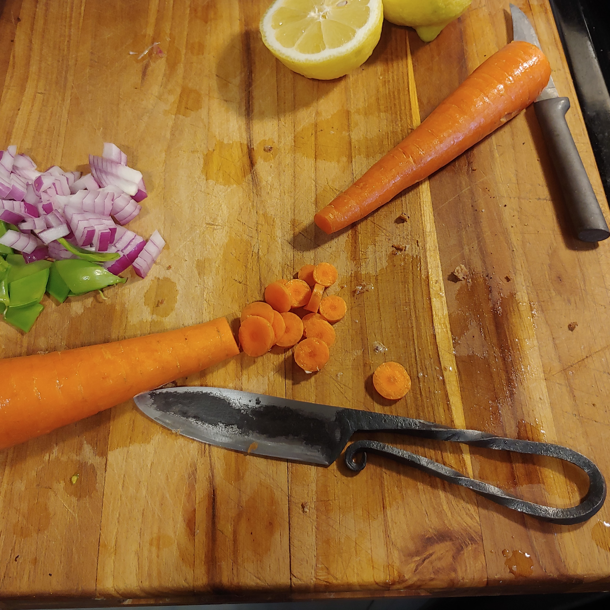
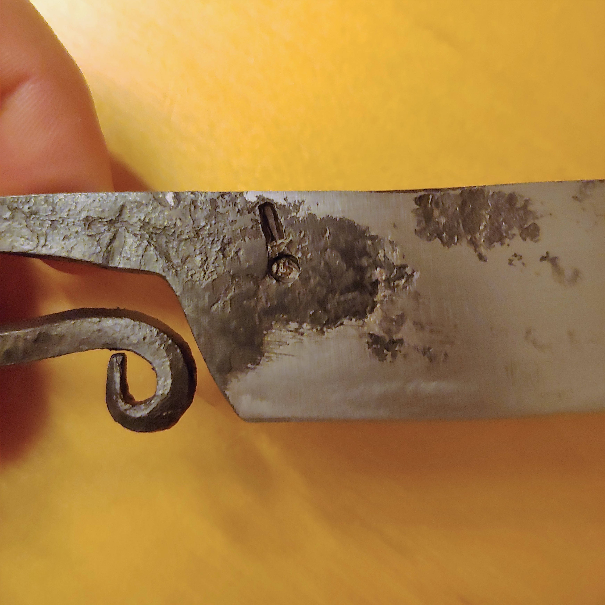
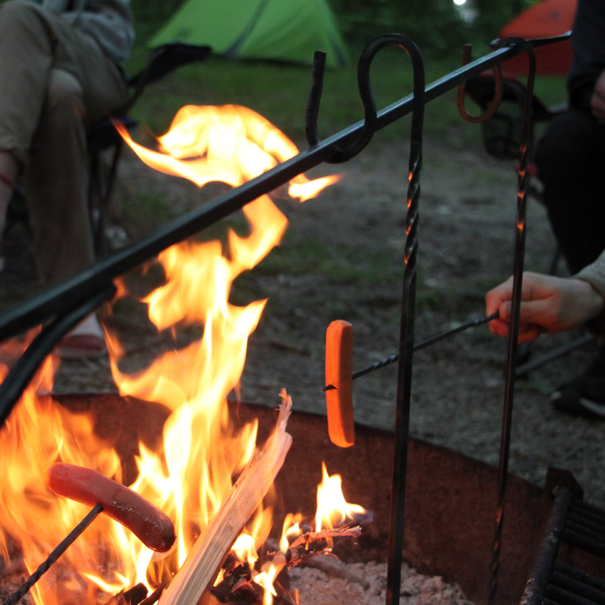
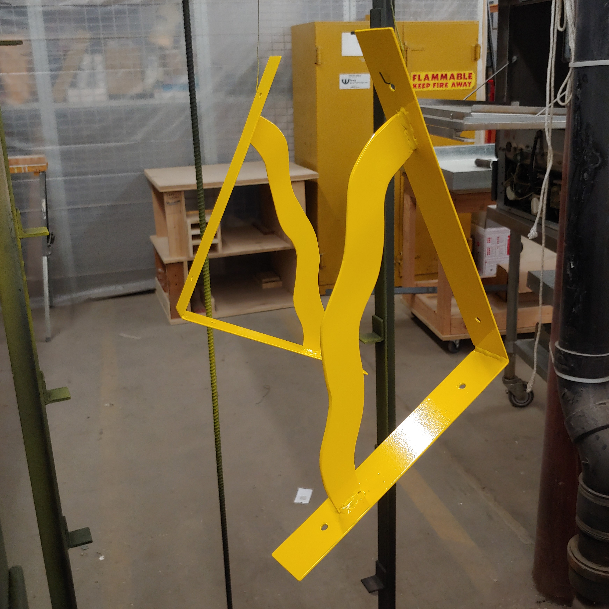
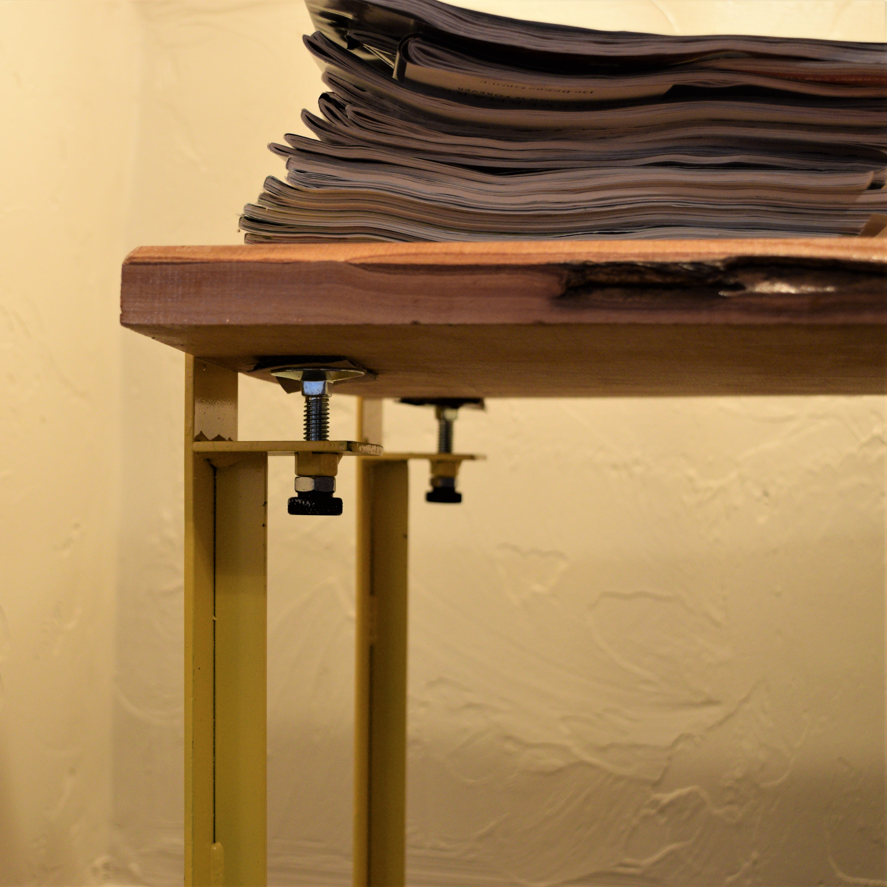
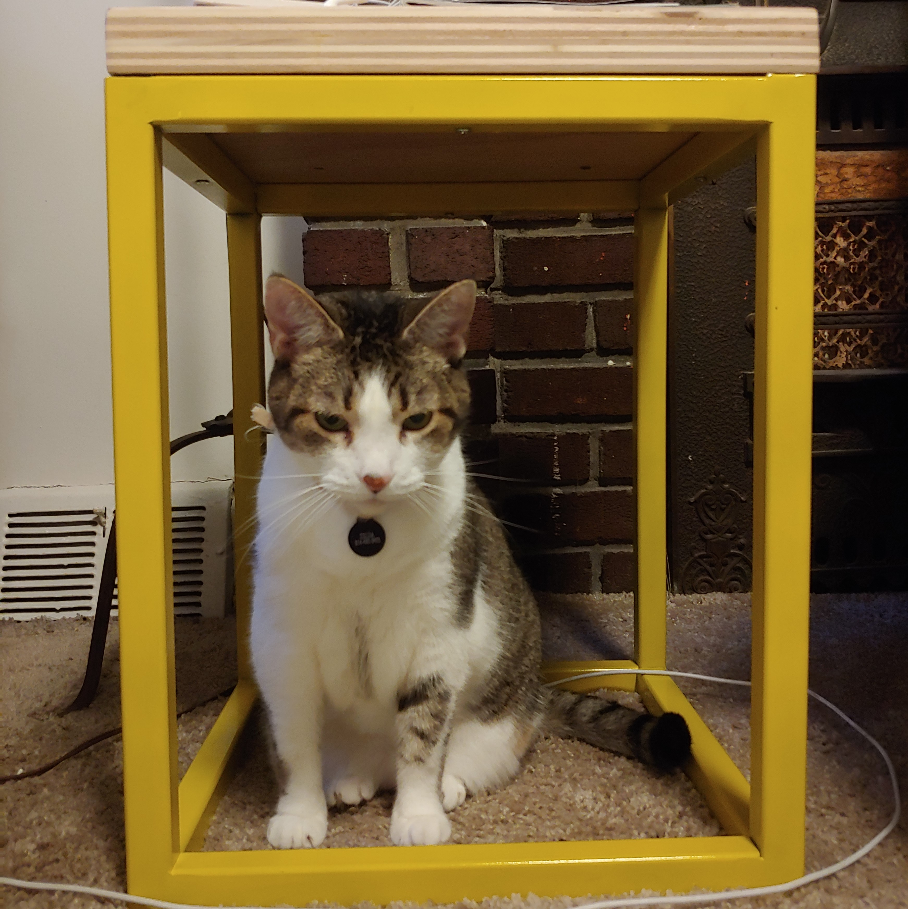
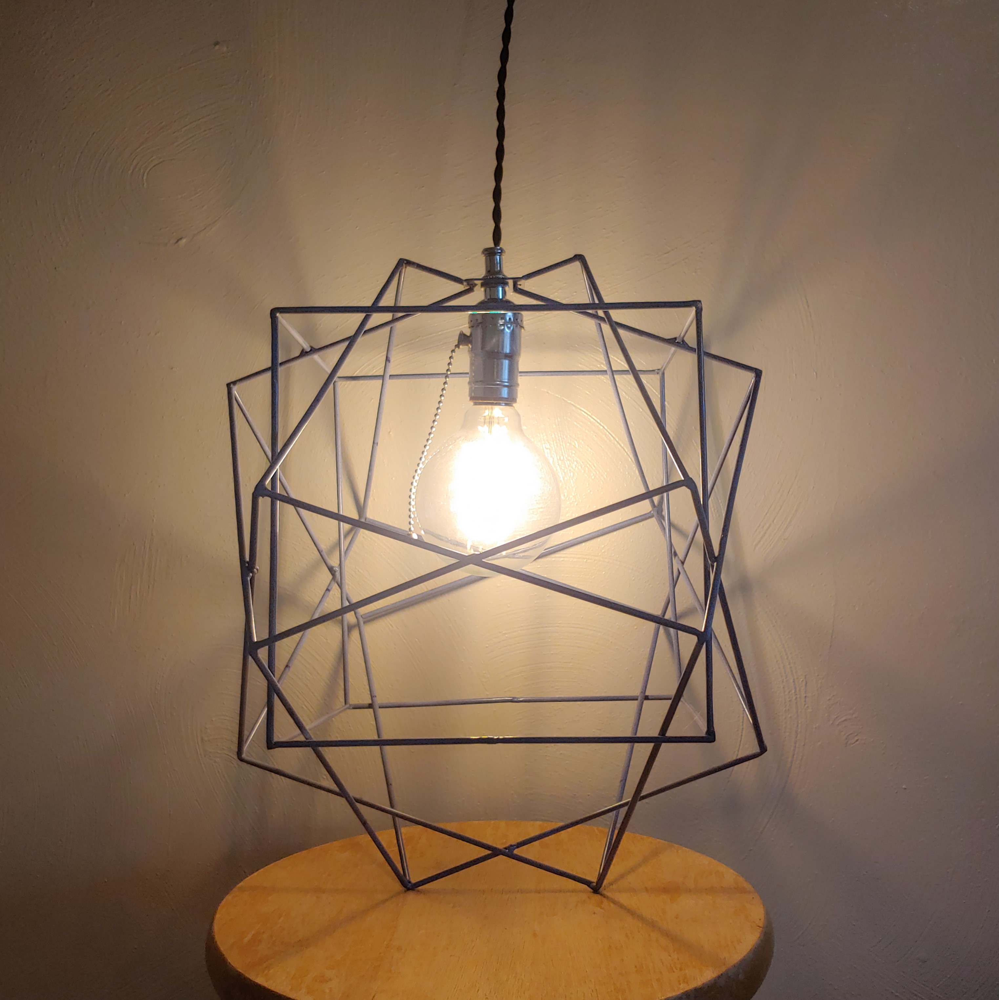
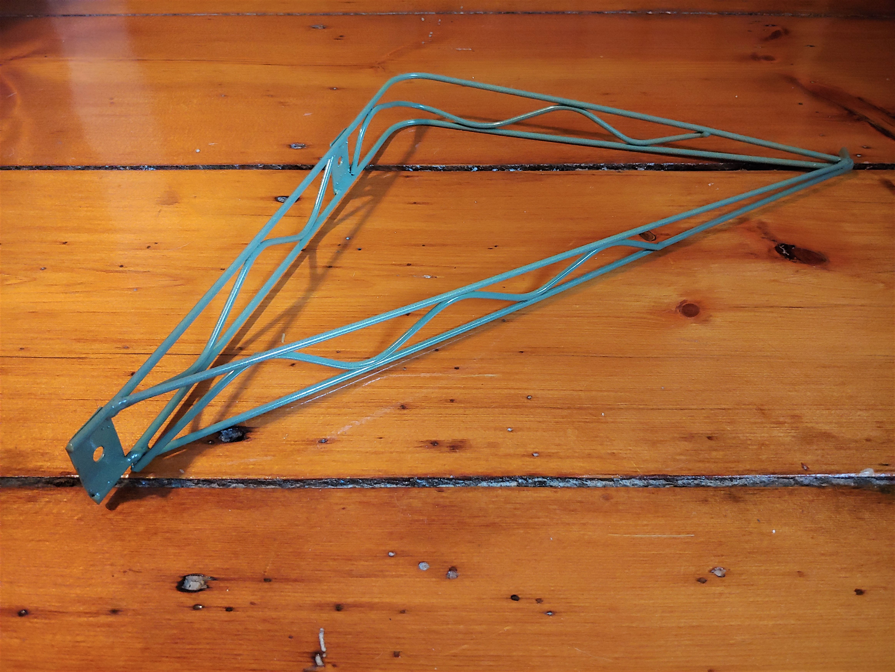
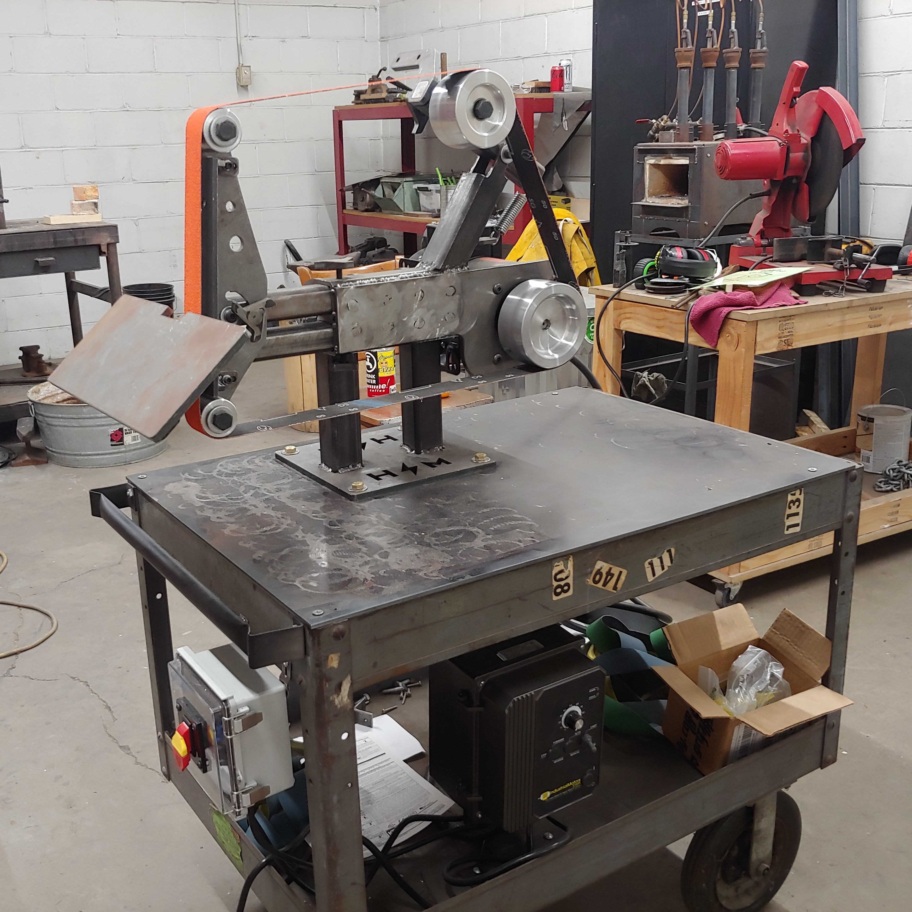

# Metalwork

    

        
        

            
Blacksmith's knife. It's very sharp!

        

    

    

        
        

            
Keep an eye out for my maker's mark!

        

    

    

        
        

            
Cooking at the campfire with blacksmithed tools

        

    

    

        
        

            
Blacksmithed tools for cooking over the campfire

        

    

    

        
        

            
Freeform shelf brackets fresh from the powder-coating oven

        

    

    

        
        

            
Welded clamp-on legs for a modular table

        

    

    

        
        

            
Matching bed-side tables with a TIG-welded and powder-coated frame

        

    

    

        
        

            
Zelda under her favorite welded table

        

    

    

        
        

            
Geometric hanging light made from recycled yard signs

        

    

    

        
        

            
Outdoor plant hanger made from recycled yard signs

        

    

    

        
        

            
A near-complete belt grinder built for Protohaven PGH

        

    

    

        
        

            
A table frame getting ready for the powder-coating oven

        

    

