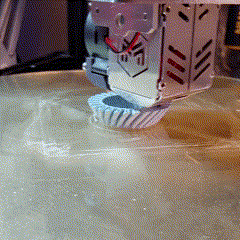
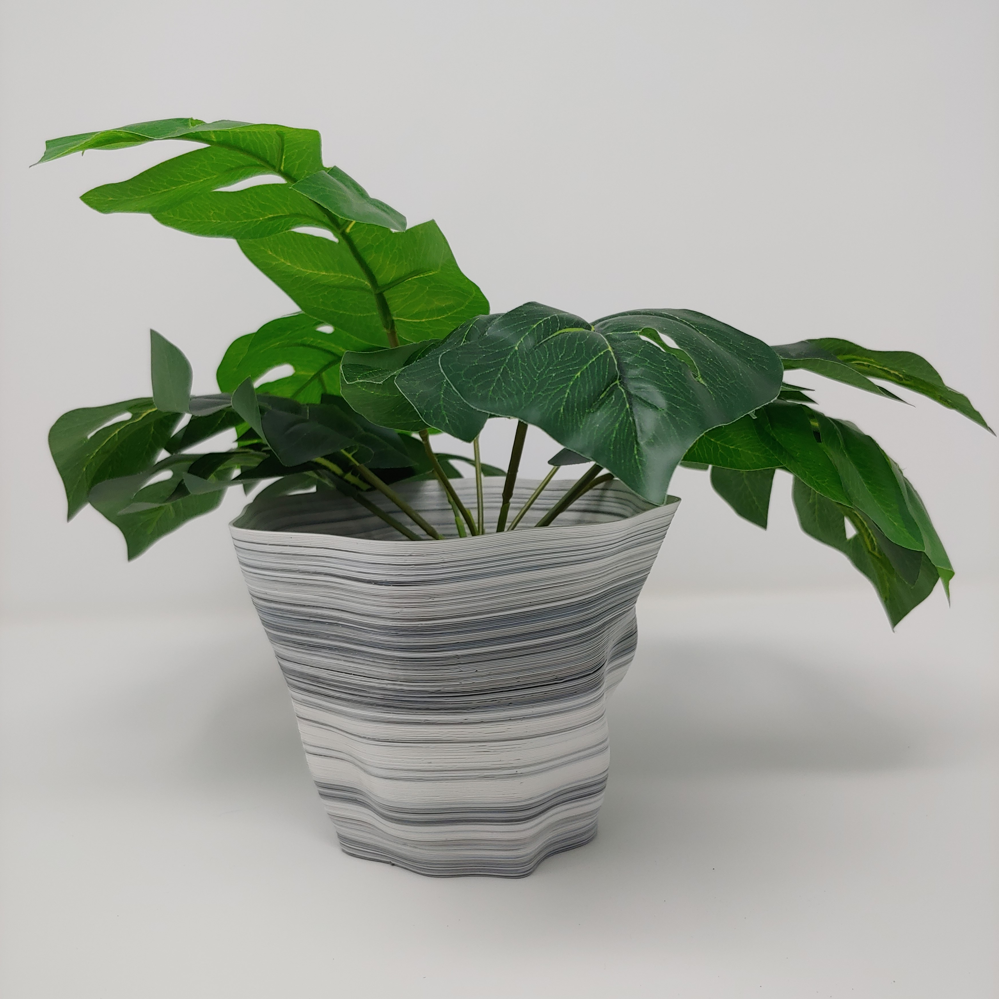
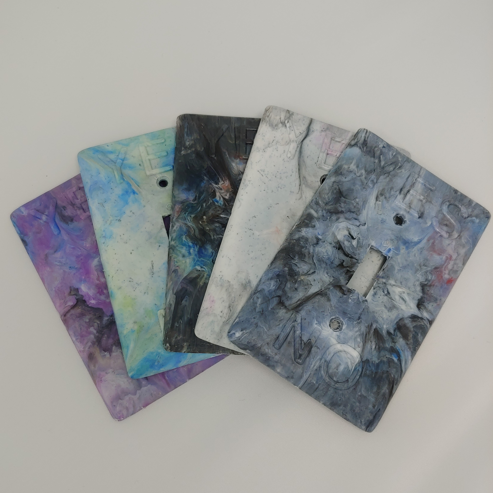
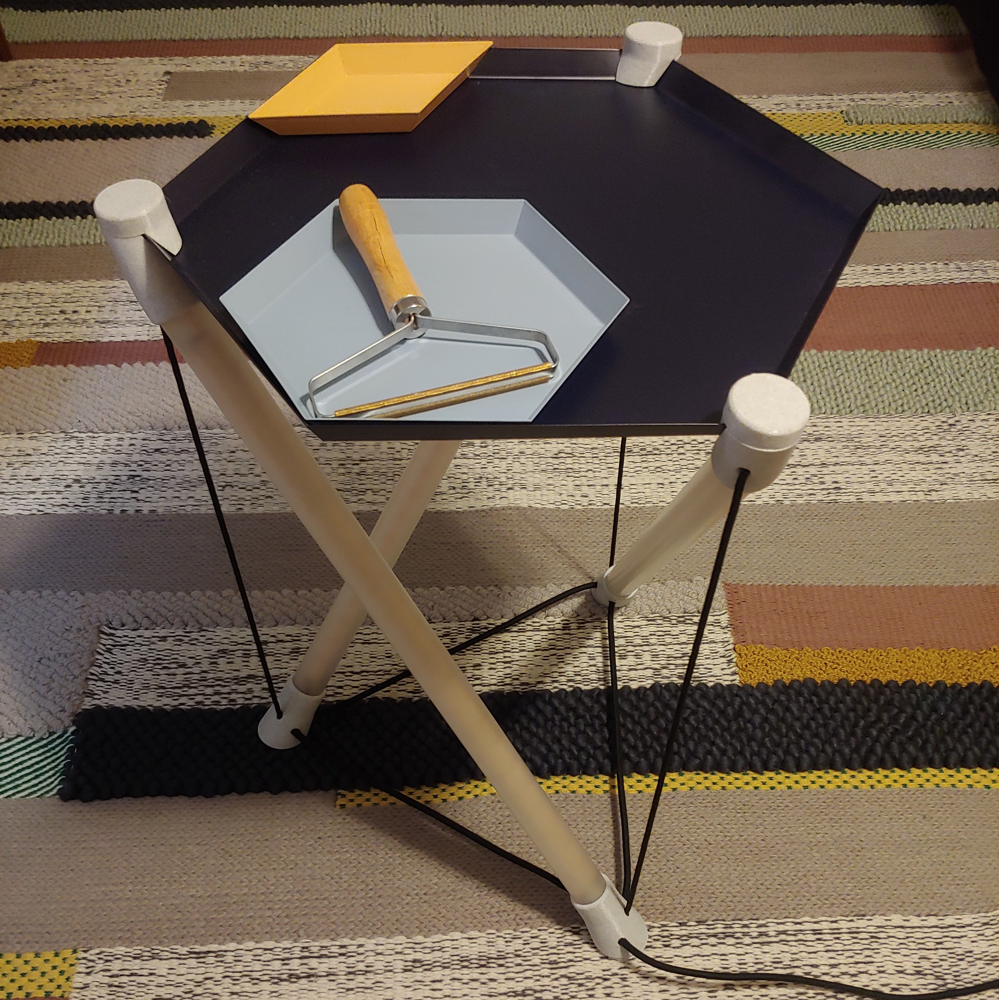
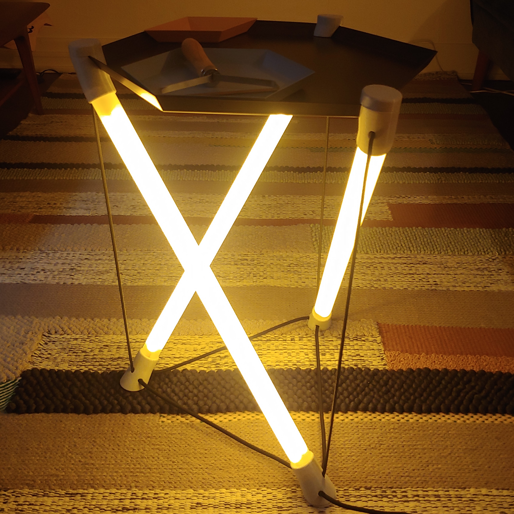
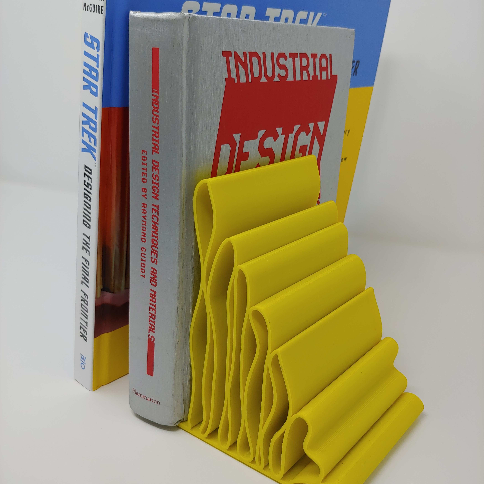
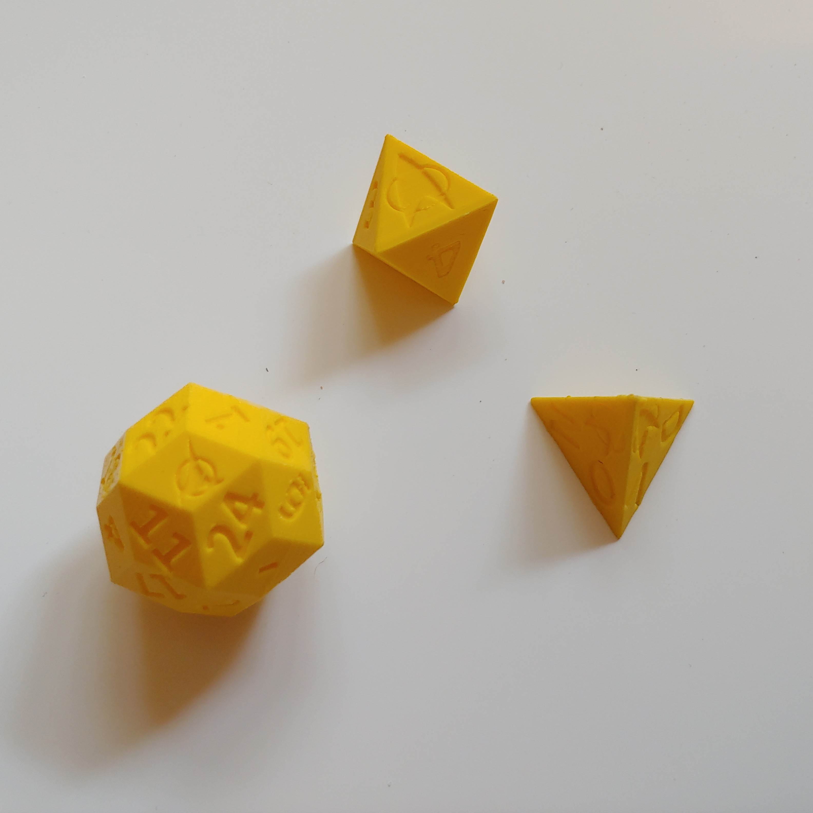
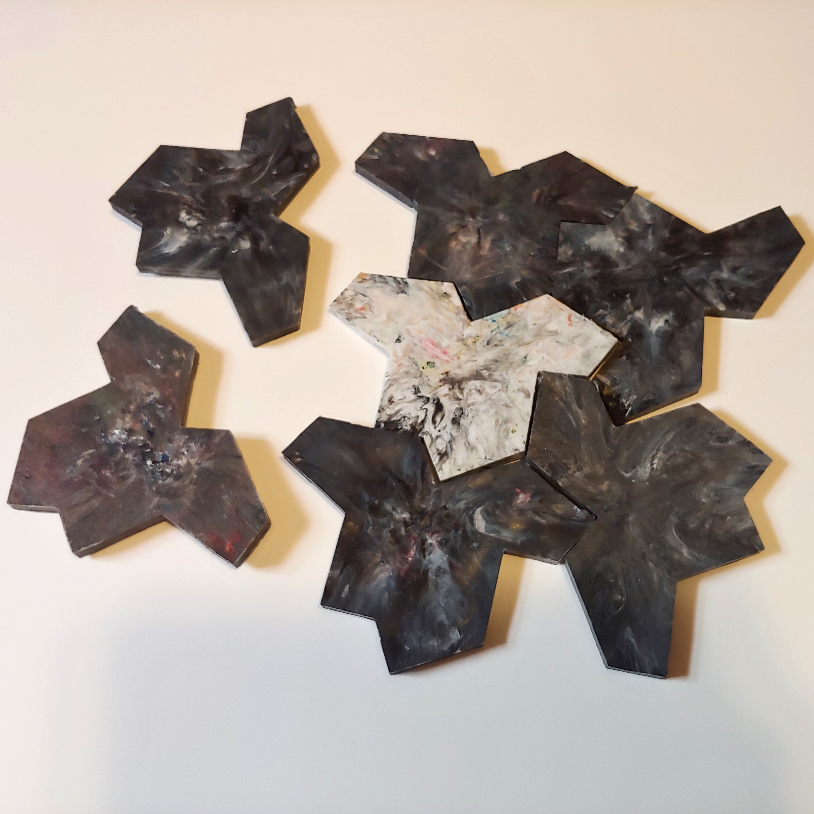
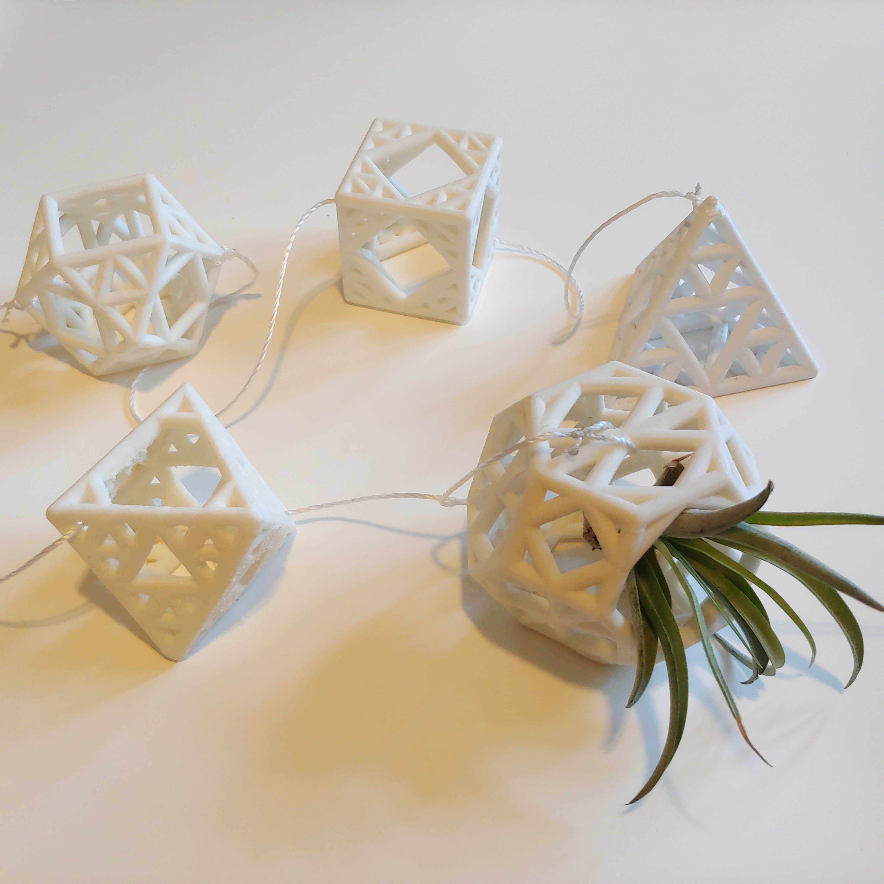

# Plastic

    

        
        

            
My custom-designed and built pellet extrusion 3D delta printer can print directly from recycled plastic flake.

        

    

    

        
        

            
This "Random Vessel" design is algorithmically generated and 3D printed from 100% post-industrial ABS scrap.

        

    

    

        
        

            
Injection molded light switch covers made from 100% recycled PP.

        

    

    

        
        

            
CNCing a custom injection mold.

        

    

    

        
        

            
Throwing some trash into my refurbished plastics grinder. These flakes will eventually either go into the injection molder, or my pellet-extrusion printer to make recycled plastic products.

        

    

    

        
        

            
Tensegrity table with 3D printed nodes for wire-routing, electronics concealment, and structure

        

    

    

        
        

            
And the struts light up! 

        

    

    

        
        

            
"Wiggle Book End" 3D printed from 100% recycled PET-G

        

    

    

        
        

            
3d printed tetrahedral, octahedral, and triacontrahedral dice for deciding which classic Star Trek episode I'm going to watch.

        

    

    

        
        

            
"Hat" shaped aperiodic monotiles injection molded with recycled HDPE and PP plastic

        

    

    

        
        

            
3D printed, Sierpinski-sieved, Archemedian solids for hanging my air plants

        

    

    

        
        

            
Injection molder revived from the dead and working like new!

        

    

