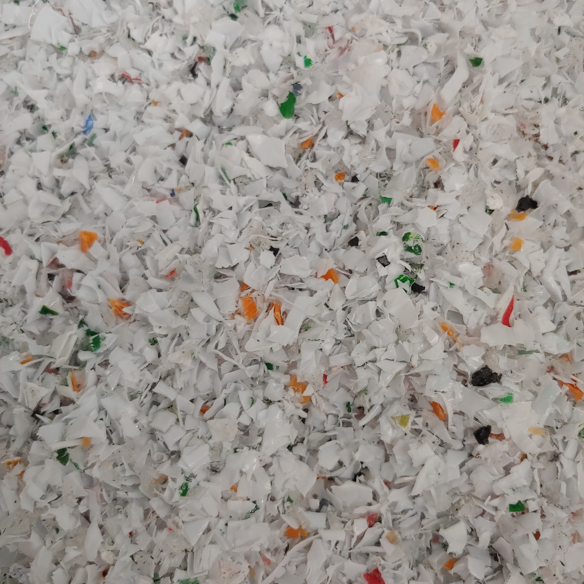

# Plastic

    

        
        

            
Tensegrity table with 3D printed nodes for wire-routing, electronics concealment, and structure

        

    

    

        
        

            
And the struts light up! 

        

    

    

        
        

            
Post-consumer HDPE shredded using a plastics grinder I rebuilt and referbished

        

    

    

        
        

            
3d printed tetrahedral, octahedral, and triacontrahedral dice for deciding which classic Star Trek episode I'm going to watch.

        

    

    

        
        

            
"Hat" shaped aperiodic monotiles injection molded with recycled HDPE and PP plastic

        

    

    

        
        

            
3D printed, Sierpinski-sieved, Archemedian solids for hanging my air plants

        

    

    

        
        

            
Injection molder revived from the dead and working like new!

        

    

