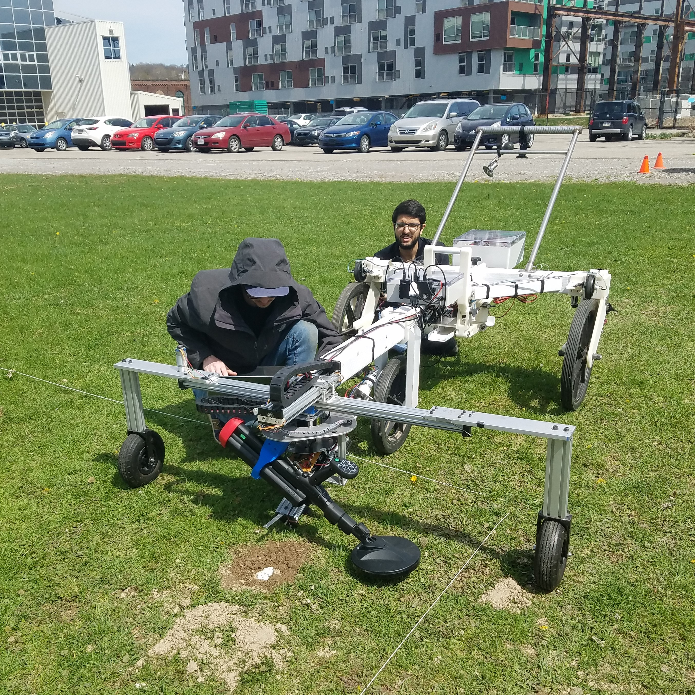
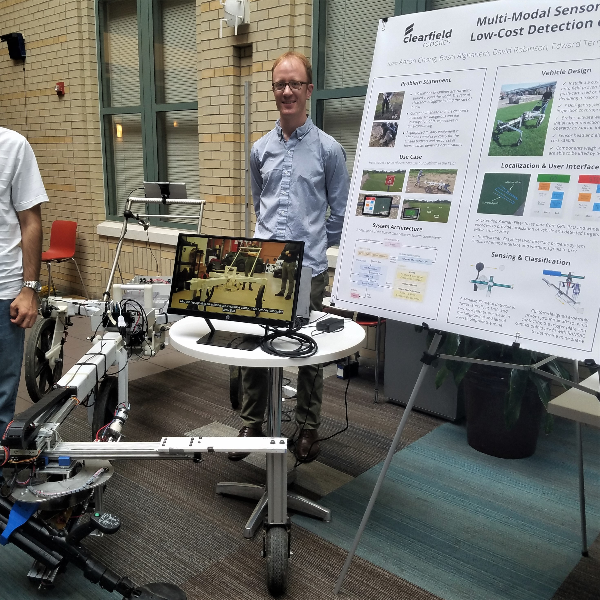
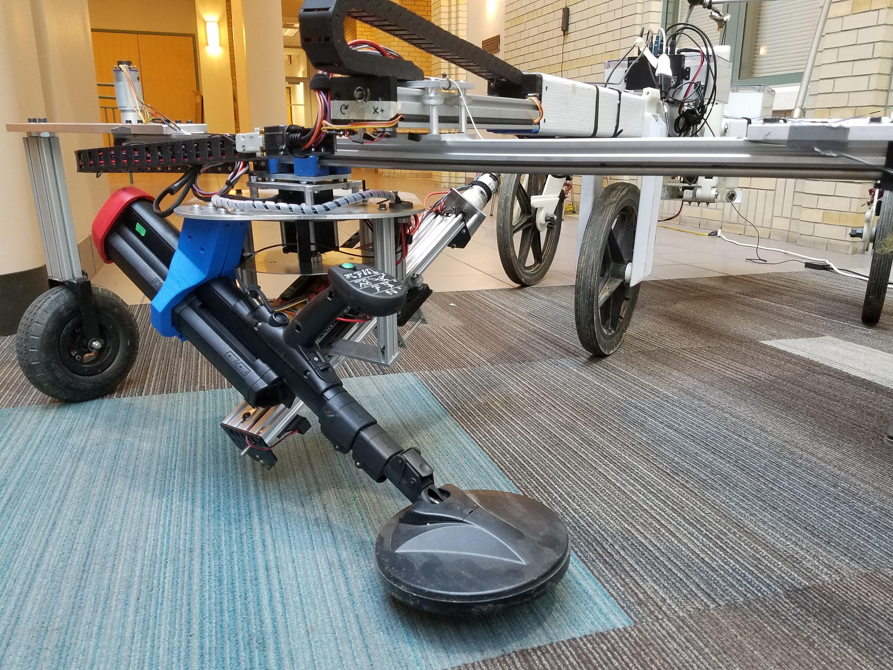
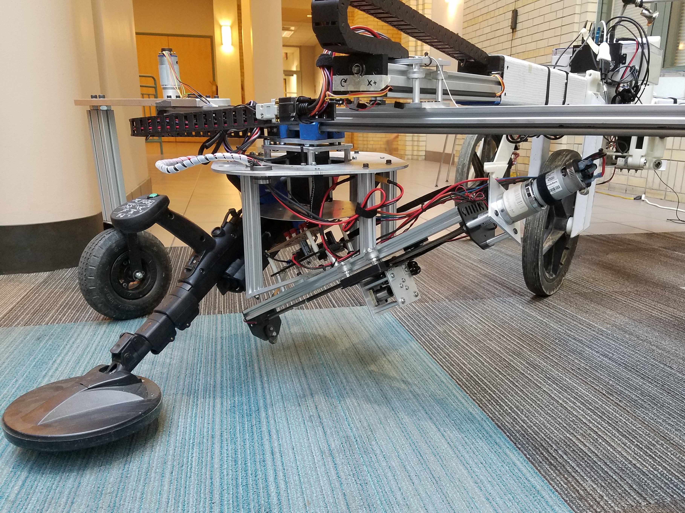
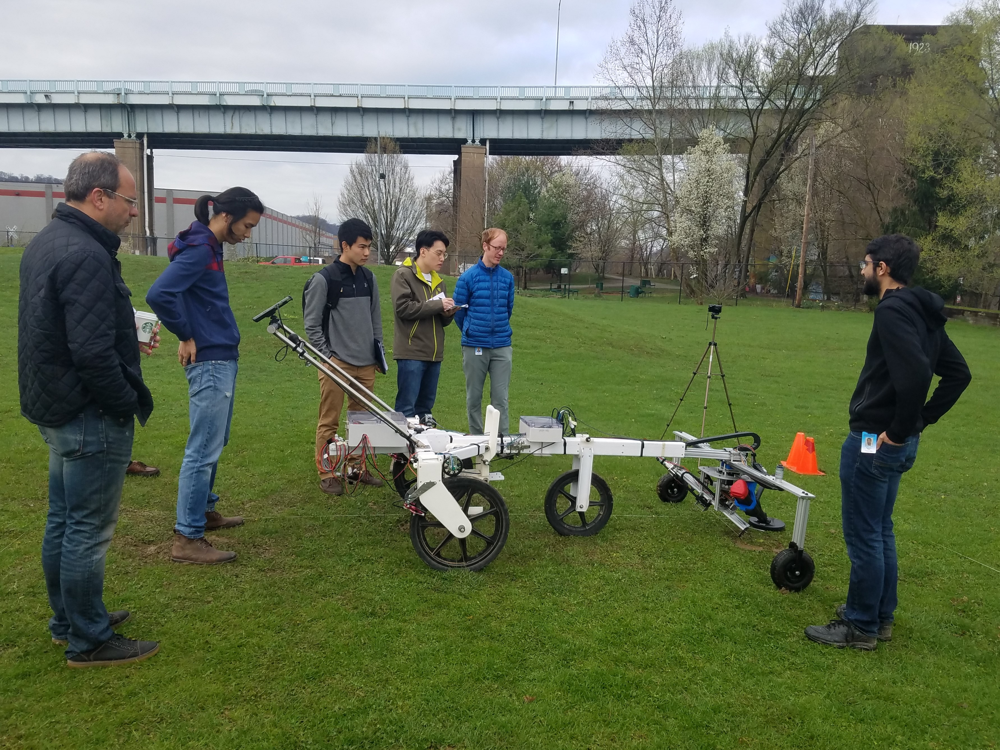
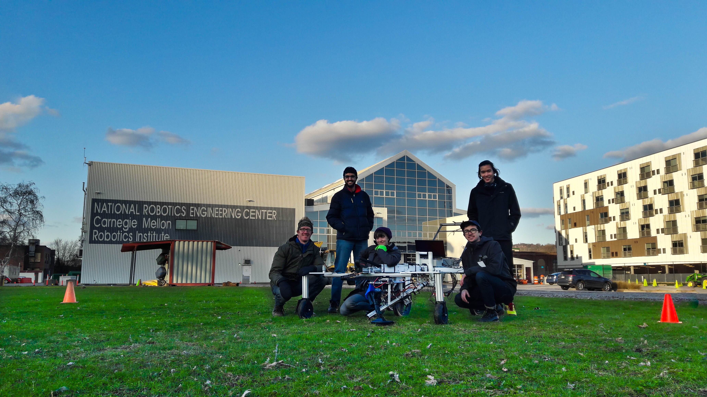

# Multi-Modal Landmine Detection

ClearField Robotics was my thesis research project for my Masters in Robotics Systems Development at Carnegie Mellon University.

Landmines are a tragic remnant of war that the threaten economic security, mobility, and lives of people around the world. Though there has been a plethora of research in landmine sensing in the last few decades, most methods are expensive, energy-intensive, and result in a high number of false positives. 

By fusing multiple, low-cost sensors, the ClearField Robotics team developed a user-friendly and easily-adoptable method of landmine detection without sacrificing accuracy. We combined a traditional metal detector (for broad sweeping) and an automated probing mechanism (to classify the shape of any detected metal objects) to reduce the number of false positives, increase demining speed, and reduce demining costs.

Learn more about our research and final robotic platform <a href="https://mrsdprojects.ri.cmu.edu/2017teamb/">here!</a>

    

        
        

            
The ClearField team taking MineBot out to the NREC field for testing

        

    

    

        
        

            
Basel and David found a landmine!

        

    

    

        
        

            
Ed presents the ClearField project at a poster session

        

    

    

        
        

            
MinBot in "probing" mode

        

    

    

        
        

            
MineBot in "sensing" mode

        

    

    

        
        

            
The final validation demonstration of MineBot

        

    

    

        
        

            
The whole ClearField team celebrating at the National Robotics Engineering Center

        

    

