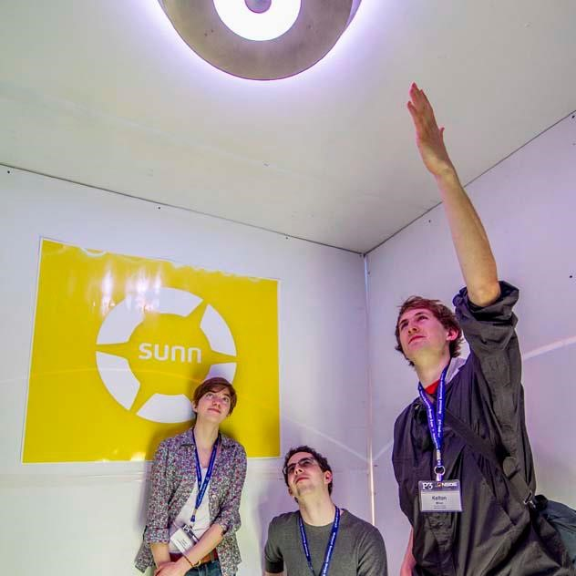

# Sunn, Inc/Cornell University Sustainable Design

As a mechanical engineer on the Cornell University Sustainable Design team, I helped design and manufacture a luminaire and portable housing structure for the Sunn light - a person and eco-friendly lighting alternative that uses fiber optic lightpipes to bring natural sunlight into window-less rooms, and suplements that light with color a tempurature-matched LED array. We presented at conventions, trade-shows, and the 2013 P3 Design Competition for Sustainability hosted by the EPA on the National Mall. 

    

        
        

            
Admiring the Sunn at the EPA's P3 Design Competition for Sustainability

        

    

# Cornell's Rapid Prototyping Lab

In 2013, I co-founded and operated Cornell's first student-use Rapid Prototyping Lab, which is still in operation today! You can read more about it in <a href="https://www.businessinsider.in/19-Incredibly-Impressive-Students-At-Cornell/Georgia-Crowther-leads-the-Cornell-Mars-Rover-team-and-co-founded-Cornells-first-lab-space-for-3D-printing-and-laser-cutting-/slideshow/32740220.cms"> Business Insider </a>

    

        
        

            
Me in the RPL

        

    

