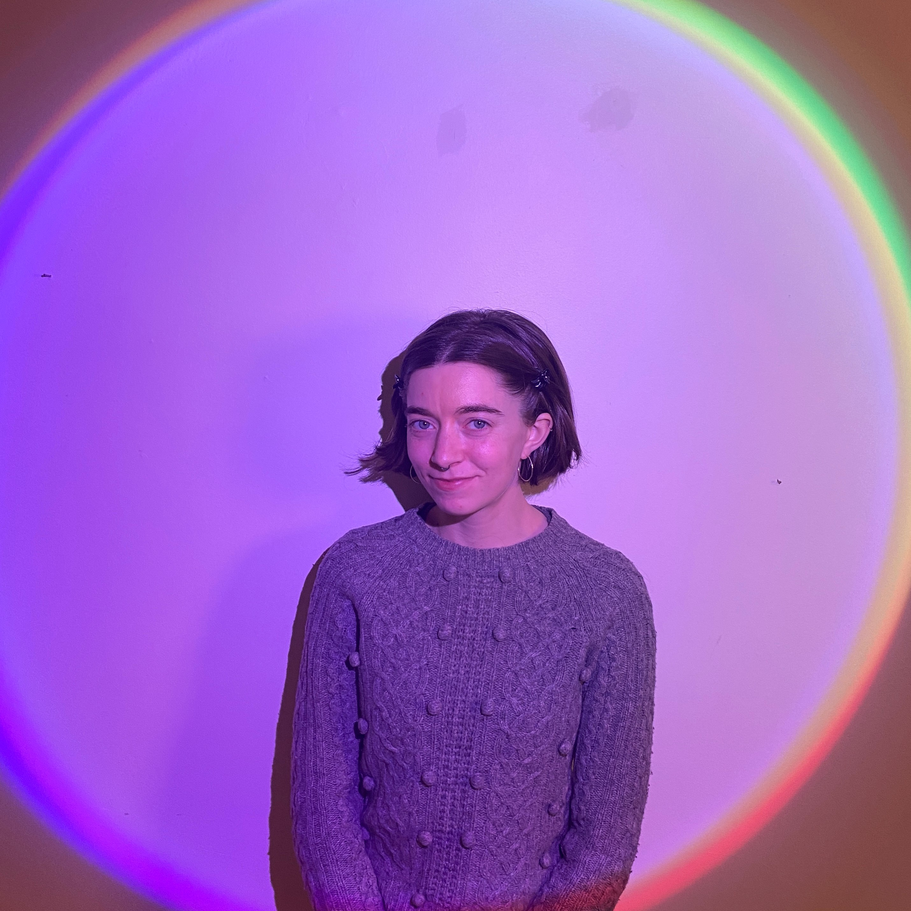

# Georgia Crowther

Hi! I am a hardware-focused robotics engineer passionate about sustainability, equity, and the potential of new technologies on and off planet Earth. 

I have a Masters in Robotic Systems Development from Carnegie Mellon University a Bachelor's in Science from Cornell University in mechanical engineering. I've worked testing and designing unique wheels for NASA moon rovers <a href="https://www.nasa.gov/feature/ames/artemis-moon-rover-s-wheels-are-ready-to-roll"> (like VIPER!) </a> and programming a robot arm to 3D printing large structures from bioplastics at <a href="https://www.instagram.com/denizen.work/"> Denizen. </a> I also designed bikes and street infrastrucutre for <a href="https://en.wikipedia.org/wiki/Jump_(transportation_company)"> Social Bicycles (later JUMP) </a> and lead <a href="https://marsrover.engineering.cornell.edu/"> Cornell's Mars Rover Project Team </a> in the international University Rover Challenge.