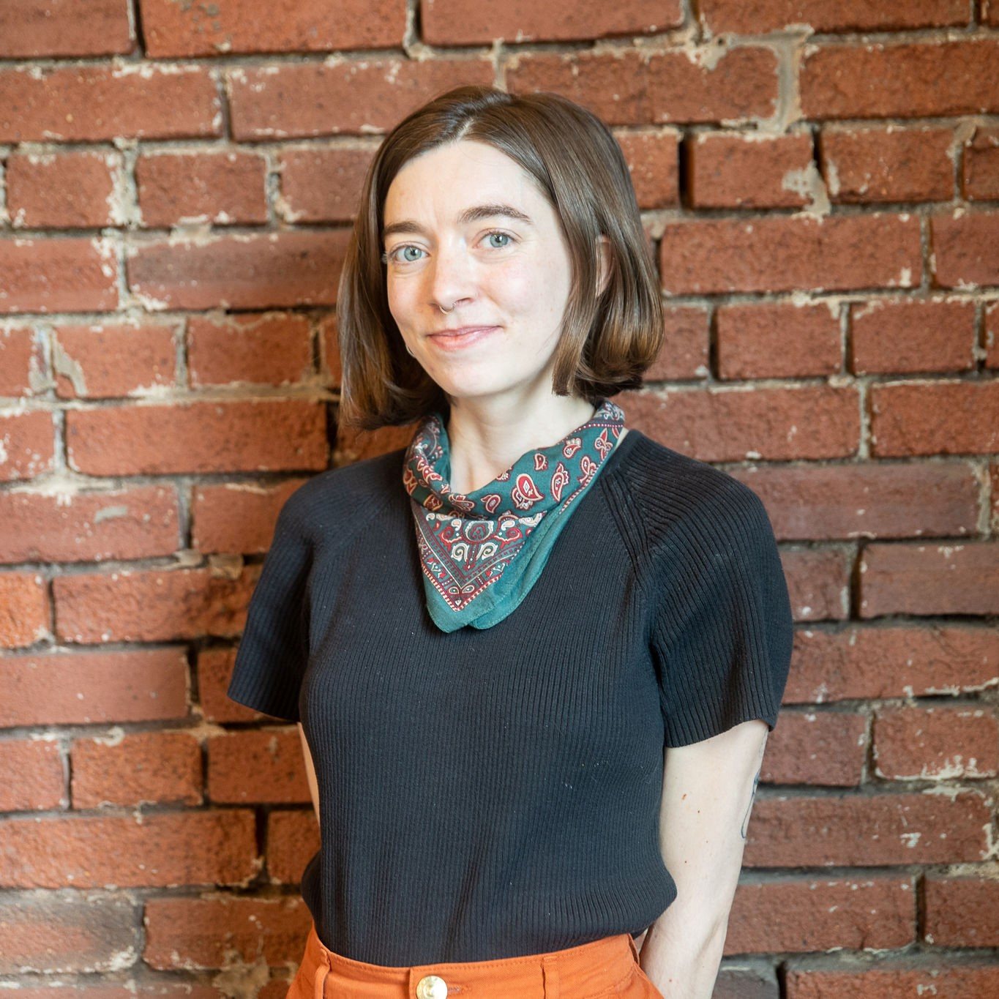

# Georgia Crowther

I am a hardware-focused robotics engineer passionate about sustainability, equity, and the potential of new technologies on and off planet Earth. I’m particularly interested in environmentally conscious materials and building methods, minimal geometries and structures, and making the things that make things.

I've worked testing and designing unique wheels for NASA moon rovers <a href="https://georgiac.github.io/work_research/tw"> (like VIPER!) </a>, building and programming a robot cell to 3D print large structures from bioplastics at <a href="https://georgiac.github.io/work_research/denizen"> Denizen</a>, and designing public bikes and street infrastrucutre for <a href="https://georgiac.github.io/work_research/sobi"> Social Bicycles (later JUMP) </a>. I've also built an autonomous landmine-detection platform for my robotics <a href="https://georgiac.github.io/work_research/minebot"> master's thesis project </a> at Carnegie Mellon, and lead <a href="https://georgiac.github.io/work_research/cmr"> Cornell's Mars Rover Project Team </a> in the International University Rover Challenge.

I'm currently the founder of Reclamation Factory <a href="https://georgiac.github.io/work_research/recfac">, where we build automated tools to make local plastics recycling affordable and feasible for everyone.

I also just love to <a href="https://georgiac.github.io/projects/">make things.</a>  

Looking for some robotics support on a project? <a href="mailto:georgia.crowther@protonmail.com"> Shoot me a note!</a>